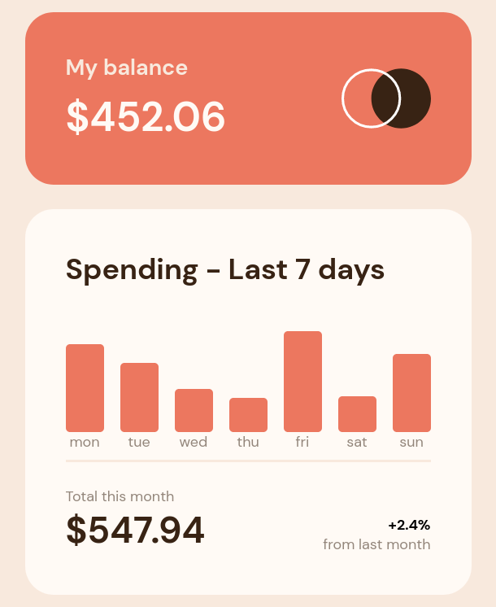
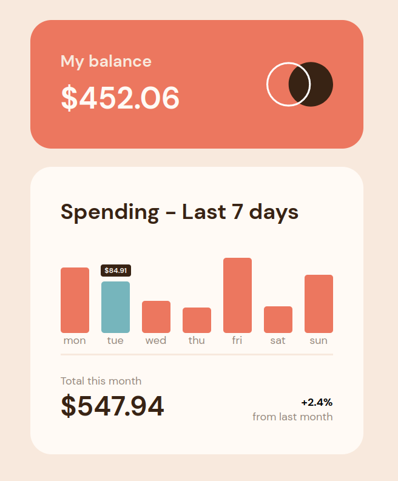

## Índice

- [Visão geral](#visão-geral)
  - [Desafio](#desafio)
  - [Imagens](#imagens)
  - [Links](#links)
- [Meu Processo](#meu-processo)
  - [Construído com](#construído-com)
  - [O que eu aprendi](#o-que-eu-aprendi)
  - [Em futuros projetos](#em-futuros-projetos)
- [Autor](#autor)

## Visão geral

### Desafio

Os usuários devem ser capazes de:

- Visualize o gráfico de barras e passe o mouse sobre as barras individuais para ver os valores corretos para cada dia.
- Veja o layout ideal para o conteúdo, dependendo do tamanho da tela do dispositivo
- Veja os estados de foco para todos os elementos interativos na página
- Use o arquivo de dados JSON fornecido para dimensionar dinamicamente as barras no gráfico

### Imagens

### Links
https://grafico-despesas-ianfs.vercel.app/

## Meu processo

### Construído com

- Marcação HTML5
- Propriedades CSS
- Flexbox
- CSS Gride
- Javascript
- API fetch

### O que eu aprendi

Nesse projeto eu aprendi a utilizar o metodo global fetch da API Fetch para buscar dinamicamente os dados em um arquivo JSON.

A utilizar a propriedade box sizing: border box, que altera a forma de calculo do Box Model, a partir disso os valores de padding e border são incluido à largura do box criado pelo elemento HTML.

A posicionar o balões flutuantes que aparecem quando o ponteiro do mouse passa em cima das barras do grafico utilizando as propriedades do CSS:, position: absolute e position: relative.

### Em futuros projetos

Em futuros projetos pretendo utilizar buscas dinamicas utilizando a API Fecth, também pretendo fazer projetos que utilizem Grid CSS e Flexbox como forma de consolidar meus conhecimentos sobre o tema.  

## Autor

- Website - [Vercel](https://vercel.com/dashboard)
- Linkedin - [@Ian França](https://www.linkedin.com/in/ian-franca/)
- GitHub - [Ian-FS](https://github.com/Ian-FS)
